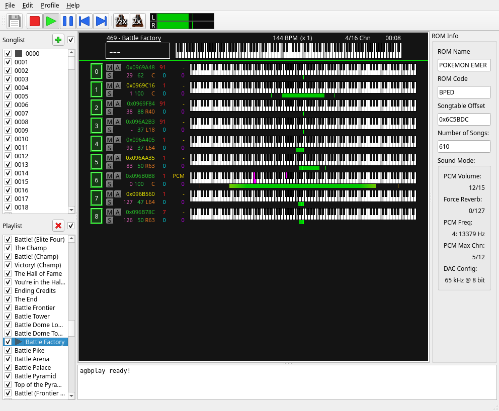

# agbplay

[](https://github.com/ipatix/agbplay/actions/workflows/build-common.yml)

## General Information

__agbplay__ is a music player for GBA ROMs, which use Nintendo's MP2K sound engine.
Because it was provided by Nintendo via their SDK, it is by far the most common sound format used, thus supports a larger catalog of commercially released games.
Games, which don't use this engine are not supported and also won't be supported in future version.

You can use agbplay to play back the music contained in those games, export them, and tweak the sound with various enhancements.
agbplay is not a perfectly hardware accurate sound player, neither was that ever the intention.
If you want something that is accurate to hardware, you should probably check out GSF players (e.g. [foo_input_gsf](https://www.foobar2000.org/components/view/foo_input_gsf)).
GSF players also have the advantage of supporting other sound formats.

The advantage of agbplay over emulators is that it is optimized for higher quality playback.
This includes e.g. the following features:

- Selectable resampling algorithms
- Unlike hardware, PCM playback is directly resampled to the desired output (instead of the two stage software mixing and DAC resampling)
- PSGs with anti aliasing filters
- Higher pitch accuracy for PSGs
- 240 Hz (instead of 60 Hz) sequencer update rate
- Defacto noise free due to floating point processing (instead of 8 bit integer)
- Support for MP2K variants (Game Freak, Camelot). Metroid and Wario Ware Twisted ("MP2K Neo") are supported, but exhibit some bugs.
- Most supported games are detected and scanned fully automatic (song table, player table, sound mode)
- GBA ROM and GSF support (GSFs may not always be detected correctly due to missing game code in ROM header)

Since 2024 agbplay has a GUI version available.
It replaces the old Terminal/Curses based version and should be much more accessible to users on Windows.
While the old Curses version isn't removed, it won't receive any new features.

## Usage

### General



The GUI version should be self explanatory for the most part.
Load a ROM, select a song and have fun with the playback buttons.

If you are Windows user you can obtain the latest version on the [Releases page](https://github.com/ipatix/agbplay/releases).
Mac and Linux users currently have to compile on their own.
See the section below for details.

### Playlist / Songlist

You may notice that there are two lists on the left side of the program:

- *Songlist*: This shows all song numbers, which the scanner found in the ROM image.
  No names can be shown, because this information never makes it into an MP2K game.
- *Playlist*: On first launch this will be typically be empty.
  You can add entries from the song list here and assign names.
  The only difference between the two is that this one is customized to your liking.

Each entry in those lists has a check box.
These check boxes can be used to select songs, which should be exported when doing so in the menu.
The quick export only exports the current song, while the regular export respects the selection.

### Visualizer

In the center of the program you can interactively observe the state of the song currently being played back.
There are three buttons for each track:

- *Mute (red)*: Mutes/unmutes a track
- *Solo (green)*: Mute all other tracks besides the solo ones
- *Analyze (blue)*: Enable chord analyzer: Enable this on one or multiple tracks to get real time harmony analysis

### Menu Bar

- *File*: Open, export, benchmarking. Should be self explanatory
- *Edit*: Global program settings (independent of game)
- *Profile*: Manage profile specific settings (see Profile section).
- *Help:*: Info about the program.

### Profiles

#### General

agbplay has the concept of _profiles_.
A ROM / GSF may have one or more matching profiles, which themselves are game specific settings (e.g. how to handle playback, various overrides, etc.).
If there are multiple matching profiles, agbplay will ask you on ROM load which one to load.
You can use a profile to adjust settings on how to handle playback (e.g. enhancements).
The playlist is also stored in this profile, so if you need multiple playlists, use profiles to separate them.

*DISCLAIMER*: The buttons to delete/add/copy profiles in the profile editor do not function properly.
Use at your own risk.

#### Importing tags from GSF files

Manually creating playlists/tags for some games can be avoided if you can find an existing GSF set for that particular game.
Use `Profile -> Import GSF Playlist` to do so.

#### Sound Mode

On Nintendo's engine (that runs on the hardware) it allows the developer to set a master volume for PCM sound from 0 to 15.
This doesn't affect PSG sounds and changing it will result in a different volume ratio between PCM and PSG sounds.

As for the reverb level, you can globally set it from 0 to 127.
This overrides the song's reverb settings in their song header.

The 'magic' samplerate values are listed below.
Note that the 'magic' values correspond to the values like they are used by m4aSoundMode (values: 1-12).
`agbplay` will use this 'magic' value to get the sample rate for so-called "fixed frequency sounds".
However, for there is no longer an intermediate software mixing frequency of that value, unlike real hardware.

`5734`, `7884`, `10512`, `13379`, `15768`, `18157`, `21024`, `26758`, `31536`, `36314`, `40137`, `42048`

#### Enhancements

##### Reverb

Most games just use Nintendo's default reverb algorithm (or reverb of 0 for no reverb at all).
However, some games have implemented their own algorithms.
agbplay supports the following reverb types.

- Nintendo's normal reverb algorithm
- Camelot's reverb used in Golden Sun 1
- Camelot's reverb used in Golden Sun TLA (aka Golden Sun 2)
- Camelot's reverb used in Mario Golf - Advance Tour
- A test reverb algorithm. Only used for development (or for your custom algorithm).
- None at all

##### Resampling

agbplay supports multiple resampling algorithms.
An algorithm can be used for both normal resampling and for fixed frequency sounds, which on console would usually only be resampled by hardware (instead of software and hardware).
The idea is many sound effects and percussion/drums will typically be a fixed frequency sound.
For those it may sound better to use a different algorithm.

The actual algorithms themselves of course differ in "quality", but they do have to different purposes in mind.

- *Nearest Neighbor*: Fast!
  Commonly referred to as "no interpolation".
  Sounds pretty bad in most cases but can give you that low quality crunchyness.
  You most likely want to use *BLEP* over this one (`nearest` is wayyyyyyy cheaper to compute, though).
- *Linear*: Fast!
  Interpolate samples in a triangular fasion.
  This is what's used with Nintendo's sound driver (although with a second stage nearest neighbor at hardware).
  Recommended for normal sounds, but *BLAMP* is a higher quality version of this.
- *Sinc*: Slow!
  Use a sinc based filter to avoid aliasing.
  For most games this will filter out a lot of the high freuqnecies.
  The only case I'd recommend this is for games that generally use high samplerate waveforms (I like to use it on Golden Sun TLA which uses 31 kHz for drums).
- *BLEP*: Slow!
  This generates bandlimited rectangular pulses for the samples.
  It's similar to *Nearest* but latter one will not bandlimit the rectangular pulses, so it's going to cause frequency band folding.
  Use *BLEP* if you want to fake some brightness into your drums (i.e. fixed frequency sounds), since this is the way hardware does it (except *BLEP* will clean up the higher frequencies which *Nearest* doesn't).
- *BLAMP*: Slow!
  Same as blep but creates bandlimited triangular pulses instead of rectangular ones.
  Use this as high quality alternative to *Linear*.

## Compilation / Building

Install the required packages from the list.
After that it should be as simple as running the following commands.

```bash
cmake -S . -B build -DCMAKE_BUILD_TYPE=RelWithDebInfo
cmake --build build
```

Do not use the pure debug build unless you're debugging.
Performance may be really bad with the high quality resamplers.

## Dependencies

Package       | Debian/Ubuntu      | Arch          | MinGW
---           | ---                | ---           | ---
argparse      | libargparse-dev    | argparse      | N/A (fetched via CMake)
libfmt        | libfmt-dev         | fmt           | fmt
nlohmann JSON | nlohmann-json3-dev | nlohmann-json | nlohmann-json
Boost         | libboost-all-dev   | boost         | boost
libzip        | libzip-dev         | libzip        | libzip
zlib          | zlib1g-dev         | zlib          | zlib
ncurses       | libncurses-dev     | ncurses       | N/A (curses UI not available)
portaudio     | portaudio19-dev    | portaudio     | portaudio
Qt6           | qt6-base-dev       | qt6-base      | qt6

Because the ncurses UI is not available on Windows, no package for MinGW is listed.
The package names shown for MinGW are not exact and they need to be expanded to the following schema: `mingw-w64-$ARCH-$PACKAGE`.
Alternatively, you can use `pacboy` on MinGW to install the package for the environment currently running under.
Only x86_64 is known to work, i686, ucrt, and clang currently don't work.
I don't remember what as preventing those to work.
There isn't anything in the code, which should prevent those to work, but I just didn't spent the time investigating the cause.

## Legacy Curses Version

### General

For the majority of its lifetime agbplay only had a Curses based UI.
Since 2024 there a Qt GUI is available and is intended to replace the curses UI.
While the curses UI is not removed it won't get any new features.
In the chapters below you can find the info about the curses version.


### Controls
- Arrow Keys or HJKL: Navigate through the program
- Tab: Change between playlist and songlist
- A: Add the selected song to the playlist
- D: Delete the selected song from the playlist
- T: Toggle whether the song should be output to a file (see R and E)
- G: Drag the song through the playlist for ordering
- I: Force song restart
- O: Song play/pause
- P: Force song stop
- +=: Double the playback speed
- -: Halve the playback speed
- Enter: Toggle track muting
- M: Mute selected track
- S: Solo selected track
- U: Unmute all tracks
- N: Rename the selected song in the playlisy
- E: Export selected songs to individual track files (to "$cwd/wav")
- R: Export selected songs to files (non-split)
- B: Benchmark, run the export program but don't write to file
- F: Save Playlist: The playlist is also saved when the program is closed
- Q or Ctrl-D: Exit rrogram
- !: Show extended song information

### Terminal Colors

agbplay Curses version requires 256 color terminal support.
If you happen to see the message `Terminal does not support 256 colors`, you may have to use a different terminal emulator or you have to fix your `TERM` variable.

If you are using the Cygwin environment, you can do the following:

- Right click on the titlebar of the Cygwin Terminal
- Click Options
- Select "Terminal" in the tree view
- Change Type to `xterm-256color`

Another option is to use the Windows Terminal from the Windows Store (although it sometimes still seems to have a few graphical issues).

**Never ever** set your `TERM` variable in your `.bashrc` or equivalent.
This will cause issues if you are running your shell from the wrong terminal emulator.
The `TERM` string required depends on the terminal emulator you use and thus should only be set by it.

## Contributing

If you have any suggestions feel free to open up a pull request or just an issue with some basic information.
For issues I'm mostly focused on fixing bugs and not really on any new features.

If you are having an issue with some specific game, please include the following information:

- Which game (ROM code)
- Which song (if applicable)
- Any other detail

While I try to support ROM hacks as best as possible, it is sometimes difficult to support them.
This is because a lot of them have broken song entries, bad voice data, and other weird stuff.
The games themselves may work fine (because the garbage ends up being interpreted as something harmless), but agbplay has rather strict error checking.
Or to put it into other words:
If you develop a ROM hack, you can use agbplay to check if everything is right :-)
